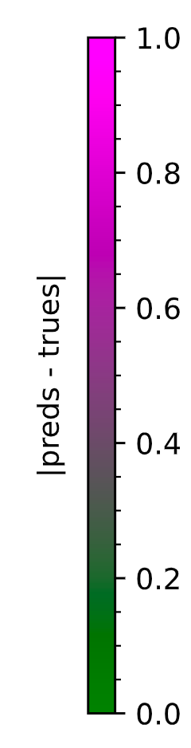
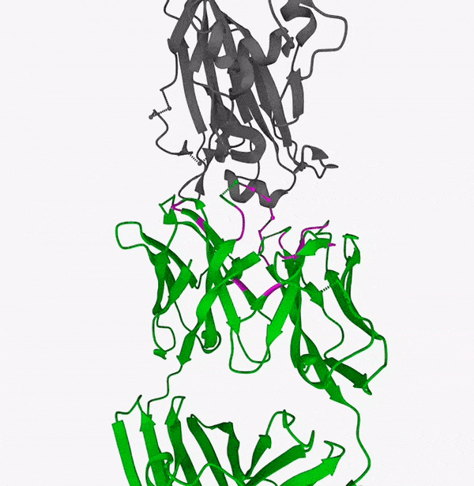
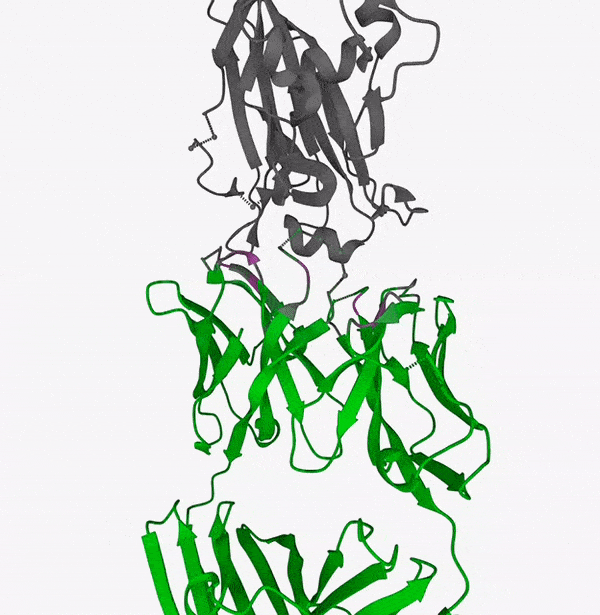
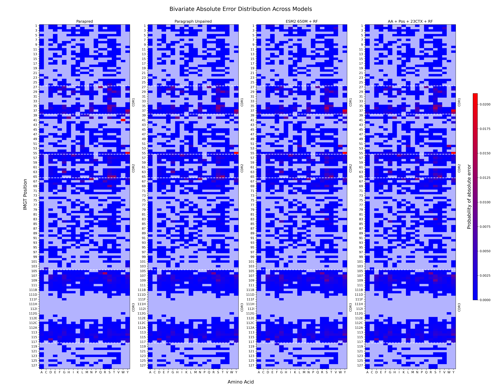

[](https://github.com/bayer-science-for-a-better-life/topefind-public)
[](https://github.com/bayer-science-for-a-better-life/topefind-public/actions)
[](https://github.com/bayer-science-for-a-better-life/topefind-public/actions)
[](https://opensource.org/licenses/BSD-3-Clause)
[](https://bayer-science-for-a-better-life.github.io/topefind-public/topefind/dashboard/dashboard.html)

⚠️ This is a temporary public version ⚠️

Antibodies are particular Y-shaped proteins. They are one of the most essential
parts of the adaptive immune system since they interact with antigens. Being
able to engineer antibodies can significantly impact the development of therapeutics,
where paratope prediction plays an essential role. Given the antibody's sequence,
predicting the paratope means finding the specific amino acids that bind to its target.
This repository provides the necessary tools to generate insights into paratope prediction,
ultimately guiding model development towards a faster and better production of therapeutics.


<table align="center">
<tr>
<th>

</th>  
<th>
Alpha Fold Multimer Contacts
</th>
<th>
ESM2 650M + RF Transfer Learning
</th>
</tr>

<tr>
<td width="10%">
  


</td>  
<td width="30%">



</td>
<td width="30%">



</td>
</tr>

<tr>
<td>

</td>
<td>
  <p align="center"> 6A0Z </p>
</td>
<td>
  <p align="center"> 6A0Z </p>
</td>
</tr>
</table>

# Table of Contents

* [Installation](#installation)
* [Dashboard](#dashboard)
* [Motivation](#motivation)
* [Models](#models)
* [Literature Datasets Summary](#literature-datasets-summary)
* [Usage](#usage)
* [Vendored](#vendored)

# Installation

The installation is currently supported with the usage of a conda environment.  
Mambaforge installation is strongly encouraged:   
[github.com/conda-forge/miniforge](https://github.com/conda-forge/miniforge)

After having installed `mamba` or `conda`, clone the repository and create the environment:

```bash
# Clone it
git clone https://github.com/bayer-science-for-a-better-life/topefind-public

# Enter
cd topefind

# Create environment
mamba env create -f environment.yml

# Activate environment
mamba activate topefind
```
# Dashboard
This repo comes with a
[dashboard](https://bayer-science-for-a-better-life.github.io/topefind-public/topefind/dashboard/dashboard.html)
made in [Panel](https://panel.holoviz.org/) 
which is provided to analyze the results on a test set with some models.
It can run on the fly on WASM, be aware that it might take some minutes to install all packages from micropip and fully open.
The dashboard can be easily modified and new results can be visualized by cloning the repo and providing a new DataFrame.

<div align="center">

https://github.com/bayer-science-for-a-better-life/topefind-public/assets/28055473/c76e4506-0aab-4318-954d-54a89108c206

</div>

# Motivation

### What can you do with better predictions?

* A more accurate prediction of the paratope, allows,
  e.g. the in-silico optimization of potential antibody candidates by first predicting
  the paratope and then optimizing on those specific amino acids of the paratope,
  or vice versa, keeping them fixed to enhance other properties such as immunogenicity,
  stability, and humanisation.

### Why is it so difficult?

* The structure of complementarity-determining regions (CDRs) is not preserved,
  especially in HCDR3, resulting in an almost uniform random pattern to learn
  in those regions; and light chains have a reduced amount of paratope residues,
  ca. 5, as opposed to ca. 10 in the heavy chain, resulting in a greater imbalance setting.

* Predictions must be close-to-perfect in an out-of-distribution setting to assess
  the method's practicality. Consider mutating residues in non-paratope-predicted
  regions to optimize a property of the antibody while keeping the predicted paratope
  fixed: if the predictions were not to be close-to-perfect, the mutations would result in
  modifying the true paratope, disrupting affinity. Given the above-mentioned paratope size,
  one wrong mutation can be detrimental to affinity by 20% in light chains and 10\%
  in heavy chains. This is why the aim of the scoring metrics is much higher for a
  practical usage of the predictors in this setting/task.

### Strange behaviour of current models and transfer learning

* The models reach a ceiling in performance on test sets (Expanded Paragraph Test Set).
* Surprisingly, the model capacity does not benefit significantly the downstream task, which contradicts downstream
  tasks behaviours on single protein properties, e.g. secondary structure prediction or contact prediction in ESM2
  models.

<div align="center">

|            | **Model**           | AP                                  | ROC AUC                             | P@5                                 | P@10                                |
|------------|---------------------|-------------------------------------|-------------------------------------|-------------------------------------|-------------------------------------|
| Baselines  | SEQ2CDR             | 0.30<sub><sup>±0.13</sup></sub>     | 0.87<sub><sup>±0.10</sup></sub>     | 0.37<sub><sup>±0.26</sup></sub>     | 0.33<sub><sup>±0.18</sup></sub>     |
|            | AF2M                | 0.31<sub><sup>±0.20</sup></sub>     | 0.81<sub><sup>±0.13</sup></sub>     | 0.39<sub><sup>±0.29</sup></sub>     | 0.38<sub><sup>±0.25</sup></sub>     |
|            | Paragraph Untrained | 0.27<sub><sup>±0.12</sup></sub>     | 0.89<sub><sup>±0.07</sup></sub>     | 0.24<sub><sup>±0.20</sup></sub>     | 0.25<sub><sup>±0.17</sup></sub>     |
| End-to-end | Parapred            | 0.67<sub><sup>±0.23</sup></sub>     | 0.95<sub><sup>±0.06</sup></sub>     | 0.49<sub><sup>±0.28</sup></sub>     | 0.49<sub><sup>±0.23</sup></sub>     |
|            | Paragraph Unpaired  | 0.74<sub><sup>±0.22</sup></sub>     | 0.95<sub><sup>±0.08</sup></sub>     | 0.58<sub><sup>±0.28</sup></sub>     | **0.57**<sub><sup>±0.23</sup></sub> |
| SSL + RF   | ESM2 8M             | 0.72<sub><sup>±0.21</sup></sub>     | **0.98**<sub><sup>±0.03</sup></sub> | 0.66<sub><sup>±0.28</sup></sub>     | 0.47<sub><sup>±0.23</sup></sub>     |
|            | ESM2 150M           | 0.74<sub><sup>±0.21</sup></sub>     | **0.98**<sub><sup>±0.02</sup></sub> | 0.69<sub><sup>±0.29</sup></sub>     | 0.54<sub><sup>±0.25</sup></sub>     |
|            | ESM2 650M           | **0.75**<sub><sup>±0.21</sup></sub> | **0.98**<sub><sup>±0.03</sup></sub> | 0.69<sub><sup>±0.29</sup></sub>     | 0.55<sub><sup>±0.26</sup></sub>     |
|            | ESM2 3B             | 0.74<sub><sup>±0.22</sup></sub>     | **0.98**<sub><sup>±0.03</sup></sub> | 0.69<sub><sup>±0.28</sup></sub>     | 0.54<sub><sup>±0.25</sup></sub>     |
|            | ESM1b               | **0.75**<sub><sup>±0.21</sup></sub> | **0.98**<sub><sup>±0.03</sup></sub> | **0.70**<sub><sup>±0.28</sup></sub> | 0.55<sub><sup>±0.25</sup></sub>     |
|            | ProtT5 XL           | **0.75**<sub><sup>±0.21</sup></sub> | **0.98**<sub><sup>±0.03</sup></sub> | **0.70**<sub><sup>±0.28</sup></sub> | **0.57**<sub><sup>±0.25</sup></sub> |
|            | RITA XL             | 0.70<sub><sup>±0.22</sup></sub>     | 0.97<sub><sup>±0.04</sup></sub>     | 0.65<sub><sup>±0.29</sup></sub>     | 0.46<sub><sup>±0.24</sup></sub>     |

</div>

### Why is this happening?

* The models learn mostly the bivariate distribution of position and amino acid type (with some extra context of nearby
  residues).
* Training a random forest on top of such simple features highlights the problem.

<div align="center">

|                      | **Model**    | AP                              | ROC AUC                         | P@5                             | P@10                            |
|----------------------|--------------|---------------------------------|---------------------------------|---------------------------------|---------------------------------|
| Simple Features + RF | AA           | 0.15<sub><sup>±0.07</sup></sub> | 0.72<sub><sup>±0.11</sup></sub> | 0.02<sub><sup>±0.09</sup></sub> | 0.02<sub><sup>±0.06</sup></sub> |
|                      | Pos          | 0.63<sub><sup>±0.21</sup></sub> | 0.97<sub><sup>±0.04</sup></sub> | 0.60<sub><sup>±0.28</sup></sub> | 0.44<sub><sup>±0.22</sup></sub> |
|                      | AA+Pos       | 0.70<sub><sup>±0.21</sup></sub> | 0.97<sub><sup>±0.04</sup></sub> | 0.65<sub><sup>±0.27</sup></sub> | 0.51<sub><sup>±0.24</sup></sub> |
|                      | AA+Pos+3CTX  | 0.71<sub><sup>±0.21</sup></sub> | 0.97<sub><sup>±0.04</sup></sub> | 0.66<sub><sup>±0.28</sup></sub> | 0.53<sub><sup>±0.24</sup></sub> |
|                      | AA+Pos+5CTX  | 0.72<sub><sup>±0.22</sup></sub> | 0.97<sub><sup>±0.05</sup></sub> | 0.68<sub><sup>±0.28</sup></sub> | 0.56<sub><sup>±0.24</sup></sub> |
|                      | AA+Pos+7CTX  | 0.72<sub><sup>±0.21</sup></sub> | 0.97<sub><sup>±0.05</sup></sub> | 0.67<sub><sup>±0.28</sup></sub> | 0.56<sub><sup>±0.24</sup></sub> |
|                      | AA+Pos+11CTX | 0.73<sub><sup>±0.22</sup></sub> | 0.97<sub><sup>±0.05</sup></sub> | 0.68<sub><sup>±0.28</sup></sub> | 0.56<sub><sup>±0.25</sup></sub> |

</div>

* The bivariate distribution of absolute error given position and amino acid type assures that the models
  fail similarly:

<div align="center">



</div>

### Open questions?

* Is this a problem of the classifier only and not the feature extractor?
* If the classifier is the problem, can we overcome the problem by weighting the loss given the frequency
  of the amino acids to not let the model fail into a local minima?

# Usage

The [`topefind`](topefind) package contains several subpackages:

* [`exploration`](topefind/exploration): exploration code to answer questions (quick and dirty)
* [`dashboard`](topefind/dashboard): visualization of results
* [`vendored`](topefind/vendored): vendored repositories

And several core modules:

* [`embedders.py`](topefind/embedders.py): embedders for protein sequences
* [`predictors.py`](topefind/predictors.py): paratope predictors (uses embedders)
* [`benchmarkers.py`](topefind/benchmarkers.py): benchmarks predictors (uses embedders and predictors)
* [`utils.py`](topefind/utils.py): utilities, plotting and necessary globals

Additionally:

* [`datasets`](datasets) is used to store datasets.
* [`models`](models) is used to store models.
* [`examples`](examples) showcases usages.

### Get a parsed and labelled version of SAbDab

To do this we need to use the [`data_hub.py`](topefind/data_hub.py).   
This will create a local copy of SAbDab in [`datasets`](datasets), and it will parse it into a convenient parquet file.
It might take a while, currently SAbDab is ~6GB. Increase the number of jobs (n_jobs) for quicker parsing.

```python
from topefind.data_hub import SabdabHub

df = SabdabHub(n_jobs=1)()
```

### Create a paratope dataset to play with

```python
# Select some columns of interest
df = df[[
    "pdb",
    "antibody_sequence",
    "antibody_imgt",
    "antibody_chain",
    "chain_type",
    "resolution",
    "scfv",
    "antigen_sequence",
    "antigen_chain",
    "antigen_type",
    "num_antigen_chains",
    "full_paratope_labels",
]]

# Let's filter according to some literature guidelines.
df = df.drop_duplicates("antibody_sequence")  # Don't bias the model.
df = df[(df.antibody_sequence.str.len() > 70) & (df.antibody_sequence.str.len() < 200)]  # Don't go < 70 ...ANARCI.
df = df[df.full_paratope_labels.apply(sum) >= 1]  # At least some positives.
df = df[(df.num_antigen_chains > 0) & (df.num_antigen_chains <= 3)]  # Follows the choice in Paragraph.
df = df[~df.scfv]  # Hard to deal with since two chains are connected.
df = df[df.antigen_type.isin(["protein", "peptide"])]
df = df[df.resolution < 3]  # Allows to define contacts above this resolution (used everywhere in literature).
df = df.reset_index()

# Done, a working dataset.
print(f"Dataset now contains {len(df)} entries")
print(f"{len(df[df.num_antigen_chains > 1])} entries are connected to multiple antigens")

sequences = df["antibody_sequence"].to_list()
labels = df["full_paratope_labels"].to_list()

test_sequence = sequences.pop()
test_label = labels.pop()
```

### Let's train a classifier on top of ESM embeddings and predict the paratope

```python

# Feel free to switch to ESM2 bigger models available under EmbedderName.
# Check `topefind.predictors` and `topefind.embedders`and choose your desired configuration.
import tabulate
import numpy as np
from joblib import Memory
from sklearn.ensemble import RandomForestClassifier

from topefind.predictors import PLMSKClassifier
from topefind.embedders import EmbedderName, ESMEmbedder

# Cache the model for further usage
memory = Memory("cache", verbose=0)
seed = 42


@memory.cache
def build_esm_rf(
        train_sequences,
        train_labels,
        emb_name=EmbedderName.esm2_8m,
        n_estimators=128
):
    return PLMSKClassifier(
        ESMEmbedder(emb_name),
        RandomForestClassifier(n_estimators=n_estimators, n_jobs=4, random_state=seed),
    ).train(train_sequences, train_labels)


esm_rf = build_esm_rf(sequences, labels)
preds = esm_rf.predict(test_sequence)
trues = np.array(test_label)
results = np.hstack(trues, preds).T

print(tabulate(results, headers=["labels", "predictions"], tablefmt="fancy_grid", floatfmt=".2f"))
```

### Predict the paratope with an end-to-end model

```python

from topefind.predictors import Parapred

parapred = Parapred()

preds = parapred.predict(test_sequence)
trues = np.array(test_label)
results = np.hstack(trues, preds).T

print(tabulate(results, headers=["labels", "predictions"], tablefmt="fancy_grid", floatfmt=".2f"))
```

# Models

Some relevant models from the literature are reported for comparison.
<div align="center">

| **Model Type** | **Model Name**                    | **Original Repository**                                                                                          | **DOI**                                                               | **Weights availability** | **Vendored**<sup>a</sup> | **Available for inference in topefind** |
|----------------|-----------------------------------|------------------------------------------------------------------------------------------------------------------|-----------------------------------------------------------------------|:------------------------:|:------------------------:|:---------------------------------------:|
| End-to-end     | Paragraph                         | [oxpig/Paragraph](https://github.com/oxpig/Paragraph)                                                            | [2022 Chinery et al.](https://doi.org/10.1093/bioinformatics/btac732) |            ✅             |            ✅             |                    ✅                    |
|                | PECAN                             | [vamships/PECAN](https://github.com/vamships/PECAN)                                                              | [2020 Pittala et al.](https://doi.org/10.1093/bioinformatics/btaa263) |            🚫            |            ✅             |             🚫<sup>c</sup>              |
|                | Parapred<br>(pytorch)<sup>b</sup> | [alchemab/parapred-pytorch](https://github.com/alchemab/parapred-pytorch)<br>[github.com/eliberis/parapred](https://github.com/eliberis/parapred) | [2018 Liberis et al.](https://doi.org/10.1093/bioinformatics/bty305)  |            ✅	            |            ✅	            |                    ✅                    |
|                | antiBERTa                         | [alchemab/antiberta](https://github.com/alchemab/antiberta)                                                      | [2022 Leem et al.](https://doi.org/10.1016/j.patter.2022.100513)      |            🚫            |            ✅	            |             🚫<sup>d</sup>              |
| SSL            | ESM                               | [facebookresearch/esm](https://github.com/facebookresearch/esm)                                                  | [2021 Rives et al.](https://doi.org/10.1073/pnas.2016239118)          |            ✅	            |            🚫            |                    ✅                    |
|                | ProtT5                            | [agemagician/ProtTrans](https://github.com/agemagician/ProtTrans)                                                | [2021 Elnaggar et al.](https://doi.org/10.1109/TPAMI.2021.3095381)    |            ✅	            |            🚫            |                    ✅                    |
|                | RITA                              | [lightonai/RITA](https://github.com/lightonai/RITA)                                                              | [2022 Hesslow et al.](https://doi.org/10.48550/arXiv.2205.05789)      |            ✅	            |            🚫            |                    ✅                    |
|                | IgLM                              | [Graylab/IgLM](https://github.com/Graylab/IgLM)                                                                  | [2022 Shuai et al.](https://doi.org/10.1101/2021.12.13.472419)        |            ✅             |            ✅	            |             🚫<sup>e</sup>              |

</div>

<sup>a</sup> check [Vendored](#vendored)  
<sup>b</sup> topefind uses parapred-pytorch provided by alchemab. The original version in Keras is provided by eliberis
and is not
considered in topefind for inference.

Some relevant models in the literature are not included for the following reasons:  
<sup>c</sup> Weights not available.  
<sup>d</sup> Weights not available.  
<sup>e</sup> License not permissive enough.

# Literature Datasets Summary

We report some relevant datasets and a brief summary of the pre-processing done to each one to
get an overview of the current landscape. Check each model's paper reported in [Models](#models) for more details.

| Method               |             Reported PR AUC             | Dataset Availability |  Dataset Size   | Dataset Pre-Processing                                                                                                                                                                                                                                                                                                                                                                                                                                                                                                                                                                                           |
|----------------------|:---------------------------------------:|:--------------------:|:---------------:|------------------------------------------------------------------------------------------------------------------------------------------------------------------------------------------------------------------------------------------------------------------------------------------------------------------------------------------------------------------------------------------------------------------------------------------------------------------------------------------------------------------------------------------------------------------------------------------------------------------|
| PECAN                |            0.68<sup>a</sup>             |          ✅           |       460       | - Get the dataset from [Darberdaku et Ferrari](https://doi.org/10.1093/bioinformatics/bty918) <br/> - Cluster at 95% maximum sequence identity <br/> - Discard complexes with antigens different than protein e.g. DNA                                                                                                                                                                                                                                                                                                                                                                                                                                        |
| Paragraph            |            0.70<sup>a</sup>             |          ✅           |       460       | - Get the PECAN dataset.                                                                                                                                                                                                                                                                                                                                                                                                                                                                                                                                                                                         |
| Paragraph Expanded   |            0.73<sup>a</sup>             |          ✅           |      1086       | - Get X-ray structures from SAbDab with a resolution < 3.0 A <br/> - Discard Fvs that contain less than 10 binding residues <br/> - Discard antibodies that have less than 50% of the binding residues in the CDR+2 region <br/> - Cluster at 95% maximum sequence identity with CD-HIT <br/> - Remove structures that ABodyBuilder can not model using 95% identity threshold                                                                                                                                                                                                                                   |
| Parapred<sup>c</sup> | 0.65<sup>a</sup> <br/> 0.72<sup>b</sup> |          ✅           |       277       | - Get X-ray structures from SAbDab with a resolution < 3.0 A <br/> - Keep only complexes that contain both heavy and light chains <br/> - Cluster at 95% maximum sequence identity (with CD-HIT)<sup>f</sup>    <br/> - Discard antibodies with < 5 residues in contact with the antigen                                                                                                                                                                                                                                                                                                                         |
| antiBERTa            |            0.74<sup>b</sup>             |    ⚠️<sup>d</sup>    | 900<sup>e</sup> | - Get X-ray structures from SAbDab with a resolution < 3.0 A <br/> - Identify paratope labels as any residue of the antibody chain that has a heavy atom within 4.5 A of a heavy atom in an antigen chain  <br/> - Include only antibodies with at least one contact in the heavy chain and one in the light chain <br/> - Cluster at 99% maximum sequence identity with CD-HIT <br/> - Perform V-gene hierarchical clustering on antibody chains and remove the clusters with < 3 antibodies <br/> - Within each cluster, bin paratope lengths and remove antibody chains corresponding to bins with < 3 counts |

<sup>a</sup> Reported by Paragraph.  
<sup>b</sup> Reported by antiBERTa.  
<sup>c</sup> We use the parapred-pytorch adapted weights.  
<sup>d</sup> The script to download the dataset for pre-training the antibody LM is given but is not functional. The
transfer-learning dataset is given but lacks the differentiation between heavy and light chains.  
<sup>e</sup> Accounts only in this case for the total number of antibody chains and not complexes.  
<sup>f</sup> Not explicitly stated by Parapred.


# Vendored

Some related works are vendored for simplicity and reproducibility.  
The ```vendored``` folder contains such software with its necessary LICENSE provided by the authors.  
Weights of trained models are stored in each vendored package, if provided by the original authors.  
We applied minor modifications to parts of the code to adapt for each use case.  
Please refer to each package for more details.

Additionally, a small part of [panel_chemistry](https://github.com/awesome-panel/panel-chemistry/tree/main)
is vendored for the [`dashboard`](topefind/dashboard).


<!---

# Supplementary Details

## How are labels computed?

Paratope labels are derived from the interface contact map.


**Definition: Interface Contact Map**

Given $\mathbf{A} \in \mathbb{R}^{n \times 3}$, $\mathbf{B} \in \mathbb{R}^{m \times 3}$, $\text{n} \in \mathbb{N},
\text{m} \in \mathbb{N}$, $t \in \mathbb{R}^+$, and a metric $d:\mathbb{R}^3 \times \mathbb{R}^3 \to \mathbb{R}_0^+$
in the metric space $(\mathbb{R}^3, d)$, the Interface Contact Map of $\mathbf{A}, \mathbf{B}$ is defined as follows:

```math
\mathbf{ICM}_{A, B} \triangleq 
    \begin{bmatrix}
    icm_{00} & icm_{01} & \dots  & icm_{0m-1}\\
    icm_{10} & icm_{11} & \dots & \vdots \\
    \vdots & \vdots & \ddots  & \vdots\\
    icm_{n-10} & \dots & \dots & icm_{n-1 m-1}\\
    \end{bmatrix}
    s.t.  
    \begin{cases}
        icm_{ij} = 1 \text{ if } d(\mathbf{a_i}, \mathbf{b_j}) < t\\
        icm_{ij} = 0 \text{ otherwise}
    \end{cases}
```

where $i \in [0, \dots n - 1], j \in [0, \dots m - 1]$.

> **Remark**: If $\mathbf{a_i}$ and $\mathbf{b_j}$ are coordinates of amino acids and $\mathbf{A}$ and $\mathbf{B}$
> represent the sequence of the coordinates of amino acids in a protein, then $\mathbf{a_i}$ and $\mathbf{b_j}$ can be
> chosen to be $C\beta$ coordinates, the centre of mass of the amino acid, or the coordinates of the closest atoms for
> each pair.


**Definition: Paratope**

Given $\mathbf{A} \in \mathbb{R}^{n \times 3}$, $\mathbf{B} \in \mathbb{R}^{m \times 3}$, $\text{n} \in \mathbb{N},
\text{m} \in \mathbb{N}$, and the $\mathbf{ICM}_{A, B}$, the Paratope $\mathbf{P} \in \{0, 1\}^{n \times 1}$ is defined
as:

```math
\mathbf{P}_{A, B} \triangleq 
    \begin{bmatrix}
    \bigvee_{j=0, ..., m-1} icm_{0j}\\
    \bigvee_{j=0, ..., m-1} icm_{1j}\\
    \vdots \\
    \bigvee_{j=0, ..., m-1} icm_{n-1j}\\
   \end{bmatrix}
```

with $j \in [0, \dots m - 1]$.

> **Remark**: In the context of protein-protein interactions and antibody-antigen interactions, where one entity can be
> in contact with more than one, this definition holds if one defines
>```math
>\mathbf{B} =
>    \begin{bmatrix}
>        \mathbf{B}_1; \mathbf{B}_2; \dots; \mathbf{B}_k
>    \end{bmatrix}
>```
>where $k \in \mathbb{N}$ is the number of entities in contact with $\mathbf{A}$.

--->

# Acknowledgements

Built with love ❤️ by Serban Cristian Tudosie during an internship at Bayer 🧬.  
Several more people have contributed: Santiago Villalba, Pedro Reis, Adrien Bitton, Sven Giese.
