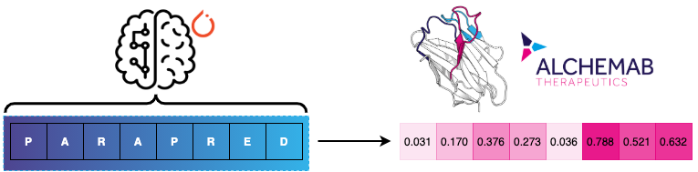
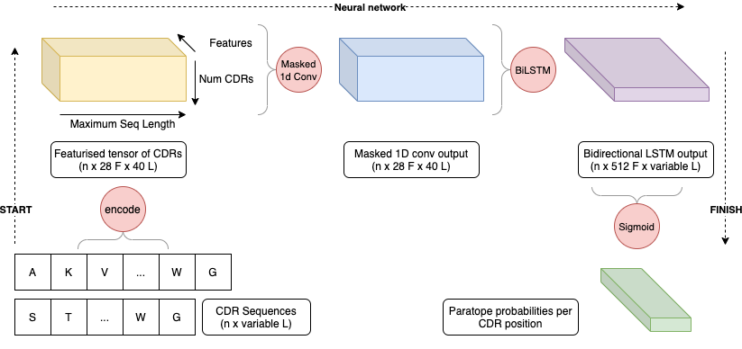

# Parapred - PyTorch

[](https://opensource.org/licenses/MIT)

[](https://pytorch.org/)
[](https://www.linkedin.com/company/alchemab-therapeutics-ltd/)
[](https://twitter.com/alchemabtx)



This repo contains a PyTorch implementation of the original Parapred code from [Liberis
et al., 2018](https://academic.oup.com/bioinformatics/article/34/17/2944/4972995). Alchemab are providing users a faster,
more modular tool to predict paratope probabilities for CDR sequences. We also provide instructions on how to integrate
`parapred` into existing Python code. 

We would also like to point users to the [original Github repo for Parapred](https://github.com/eliberis/parapred),
based on [Keras](https://keras.io/).


## Table of Contents
* [Setup](#setup)
* [Running instructions](#running-instructions)
* [Additional notes](#additional-notes)

## Setup

We provide three ways to set up Parapred.

### Conda environment
```bash
$ conda env create -f environment.yml
$ make install
```

### Pip/requirements.txt
```bash
$ pip install -r requirements.txt
$ make install
```

### Dockerfile
Building the Docker image requires a bit of memory to download and install PyTorch in the Docker container.
We advise that you allocate at least 4GB of RAM to the Docker daemon.

For Mac, this can be set by `Docker > Preferences > Resources > Advanced`. 

```bash
$ docker build -t parapred_pytorch:latest .
```

## Running instructions

Parapred takes as input any Chothia-defined CDR sequence + 2 residues on either side. We provide a [table](#numbering)
to help translate between IMGT numbers and Chothia numbers.

To run Parapred, this depends on whether you used Conda/Pip or Docker.

### Conda/Pip
After install,
```bash
$ python cli.py predict <CDR_SEQUENCE> [OPTIONS]
```

e.g. to predict on the CDRH3 sequence (+2 residues on either side) of
adalimumab (AKVSYLSTASSLDYWG) and save the results to `output_adalimumab.json`,
```bash
$ python cli.py predict AKVSYLSTASSLDYWG -v -o output_adalimumab.json
```

### Output format
The output of Parapred is a JSON file:
```json
{
  "AKVSYLSTASSLDYWG":[
    ["A",0.01034],["K",0.23327],["V",0.70882],["S",0.6835],
    ["Y",0.93412],["L",0.98127],["S",0.95116],["T",0.89977],
    ["A",0.77837],["S",0.83716],["S",0.29981],["L",0.03982],
    ["D",0.14933],["Y",0.10781],["W",0.00362],["G",0.00776]
  ]
}
```

From the command line, we advise using tools such as [jq](https://stedolan.github.io/jq/), and here's a link
to a [good blog post on how to use it](https://clarewest.github.io/blog/post/handling-json-data-with-jq/). For
example, to get the residues whose Parapred probabilities are over 0.6,

```bash
$ jq -c '.[] | .[] | select(.[1] >= 0.6)' output.json
# output using AKVSYLSTASSLDYWG
["V",0.70882]
["S",0.6835]
["Y",0.93412]
["L",0.98127]
["S",0.95116]
["T",0.89977]
["A",0.77837]
["S",0.83716]
``` 
 

### Running via Docker
The Docker equivalent is
```bash
docker run -v /tmp:/data parapred_pytorch:latest predict AKVSYLSTASSLDYWG -v -o /data/output_adalimumab.json
```
* The first `-v` flag _before_ the Docker image tag (`parapred_pytorch:latest`) mounts your `/tmp` folder to the `/data`
folder of the Docker container
* The second `-v` flag acts as the `verbose` flag for the `predict` command of the CLI tool
* The `-o` flag sets the location to save the output of the prediction JSON. This is _in context_ of the Docker
container. Thus, even if we write `/data/` here in the Terminal, it's the `/data/` folder of the Docker container,
which is actually `/tmp` of your machine (if you've mounted as we suggest above)

### Paratyping
We also include the capability for Paratyping, as described in [Richardson et al. 2021](https://www.tandfonline.com/doi/full/10.1080/19420862.2020.1869406).
Briefly, sequence positions whose paratope probabilities are greater than 0.67 are aligned, and identity is calculated
over those positions. Users can specify paratope probability thresholds using the `-t` option.

```bash
$ python cli.py paratype AKVSYLSTASSLDYWG AKVSYLSTWSSLDYWG
```

This will generate the following alignment:
```bash
AKVSYLSTASSLDYWG
  ::::::x:      
AKVSYLSTWSSLDYWG
Paratype Score=0.875
```

To interpret the alignment,
* `:` corresponds to a match for two paratope positions  
* `x` corresponds to a mismatch for two paratope positions
* `'` corresponds to a position that is a paratope in the first sequence but not in the second
* `.` corresponds to a position that is a paratope in the second sequence but not in the first  
* Gaps correspond to positions that were not predicted to be a paratope in either sequence

### Integration into a larger Python codebase
```python
import torch
from parapred.model import Parapred, clean_output
from parapred.cnn import generate_mask
from parapred.preprocessing import encode_batch

# prepare your input
sequences = (["AKVSYLSTASSLDYWG", "YCQRYNRAPYTFG"])

# PyTorch's pack padded sequence function requires length sorting from longest to shortest
sorted_cdr_strings = [cdr for cdr in sorted(sequences, key = lambda z: len(z), reverse=True)]
sorted_cdr_lookup = dict(enumerate(sorted_cdr_strings))
lookup_cdr = dict([(v,i) for i, v in enumerate(sorted_cdr_strings)])

# encoded is a tensor of (batch_size x features x max_length). so is mask.
encoded, lengths = encode_batch(sequences, max_length = 40)
mask = generate_mask(encoded, lengths)

# initialise the model and load pretrained weights
model = Parapred()
model.load_state_dict(torch.load("parapred/weights/parapred_pytorch.h5"))

# trigger evaluation mode and don't allow gradients to move around
_ = model.eval()
with torch.no_grad():
    probs = model(encoded, mask, lengths)

# this cleans up probabilities that would have been predicted for the
# padded positions, which we should ignore.
probs = [clean_output(pr, lengths[i]).tolist() for i, pr in enumerate(probs)]
 
# map back to CDR sequence; remember that we submitted length-sorted strings
mapped = [list(zip(sorted_cdr_strings[i], pr)) for i, pr in enumerate(probs)]

# we need to re-order `mapped` back to the original (unsorted) ordering 
mapped = [mapped[lookup_cdr[s]] for s in sequences]
```


## Additional notes

### How Parapred works
We encourage you to read the paper by [Liberis
et al., 2018](https://academic.oup.com/bioinformatics/article/34/17/2944/4972995) as it contains details on
the training and testing that led up to the neural network architecture and parameters. In short, 
* Parapred first featurises sequences in to a `(B x F x L)` tensor, where `F = 28, L = 40`
* Parapred then applies a masked 1D convolution; the output is still `(B x F x L)`, but a mask is applied to
"zero out" positions that should really be pads.
* The output tensor is then packed and processed by a bi-direcitonal LSTM, where the output is
`(B x * x 512)`, as the lengths of the CDRs are variable.
* Finally it is sent to a fully-connected layer with (hard) sigmoid activation to calculate probabilities



### Aims of this repo
Parapred-pytorch (this repo) is written to help researchers rapidly predict paratope probabilities of CDR sequences. It
is a more minimalist implementation that focusses more on providing inference capabilities. We provide here the
pre-trained weights from the original Parapred Github repo, which were translated to fit the PyTorch framework.

### Numbering
The original Parapred method was based on the Chothia-defined CDRs based on the Chothia numbering. We provide a table
mapping the CDR Chothia boundaries in the corresponding IMGT numbers. Note that these are **not** identical to the IMGT
boundaries of the CDRs; e.g. CDRH3 according to the IMGT definition is IMGT H105-H117. To number sequences and convert
between CDR definitions, we recommend using [ANARCI](https://github.com/oxpig/ANARCI).

| CDR | Chothia numbers | IMGT numbers | Parapred input (IMGT) | 
| --- | --------------- | ------------ | --------------- |
| H1  |  H26-H34        | H27-H37 | H25-H39 | 
| H2  |  H52-H56        | H57-H64 | H55-H66 |
| H3  |  H95-H102       | H107-H117 | H105-H119 |
| L1  |  L24-L34        | L24-40 | L22-L42 |
| L2  |  L50-L56        | L56-L69 | L54-L71 |
| L3  |  L89-L97 | L105-L117| L103-L119 |

### LSTM activations
Our implementation provides users the ability to test Parapred using `sigmoid` activations for the
LSTM layer:

```bash
$ python cli.py predict AKVSYLSTASSLDYWG -s -v
``` 

The original Parapred method was based on Tensorflow 1.2/Keras, which had used `hard_sigmoid`
activations in the LSTM step. We retain this hard sigmoid as the default, though we would like to highlight
that the hard sigmoid is an approximation of the regular `sigmoid` function (allows faster computation).  